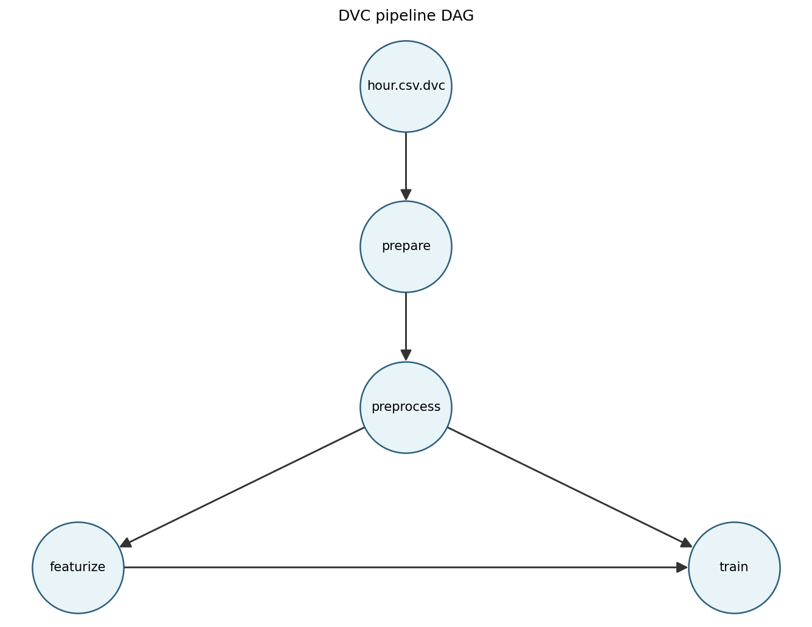
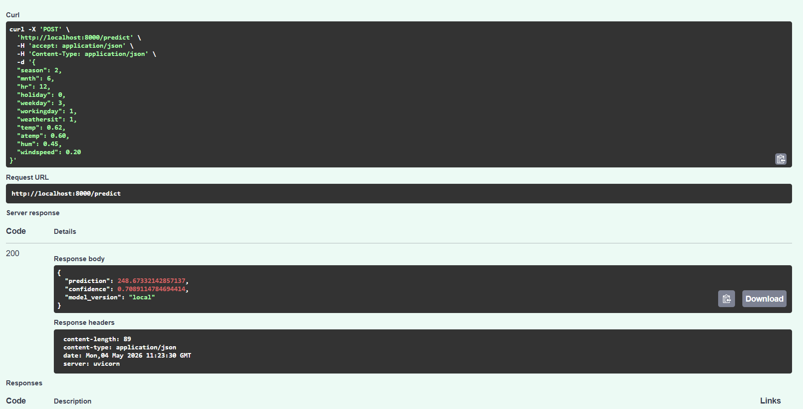

# Technical report — MLOps final project (Bike sharing demand)

This note captures evidence requested for the pipeline and reproducibility sections of the course technical report.

## DVC pipeline

The Data Version Control (DVC) graph below matches `dvc.yaml`: raw data is tracked via `hour.csv.dvc`, then stages **prepare → preprocess → featurize → train**. Training (**train**) depends on both **preprocess** and **featurize** outputs.



To regenerate the figure after dependency installs (`matplotlib`, `networkx`):

```bash
python scripts/render_dvc_dag_png.py
```

If Graphviz is installed, an equivalent diagram can be produced with:

```bash
dvc dag --dot | dot -Tpng -o docs/screenshots/dvc_dag.png
```

## Cyclical time features

Hour (`hr`) and month (`mnth`) use sine–cosine encoding (Lecture 03b) in `src/features/preprocessor.py` when `preprocessing.cyclical_hr_mnth` is true in `configs/params.yaml`. This replaces a single raw hour/month with two features each so 23 and 0 are close in feature space.

## Train / test / reference split

Year 0 is used for train, test, and reference; year 1 is used as a production/drift holdout. Within year 0, `train_test_split` is random with a fixed `random_state` (Lecture 03a: document the choice). **Stratify=** is for classification; for regression on skewed `cnt`, stratified quantile binning is possible but not used here—splits are random within the temporal year-0 block.

## Outlier policy (documented)

Numeric weather inputs are already normalised to about \([0,1]\) in the UCI file. The target `cnt` is right-skewed (peaks on holidays). We do not apply IQR or Isolation Forest (Lecture 03a) in this pipeline: the model is a Random Forest, which is relatively robust to high-count days, and the rubric does not require outlier treatment. A future improvement would be winsorising or log-transforming the target in an experiment branch.

## Feature importance (f-scores)

After `SelectKBest` fits, ranked F-scores for all engineered features (pre-selection) are written to `docs/feature_scores.json` by the featurize stage. This surfaces which columns the univariate filter considered informative before the top-`k` cut.

## Monitoring SLI/SLOs

- Prediction latency p99 SLO: `< 500 ms` measured via `bike_prediction_latency_seconds`.
- Validation RMSE SLO: `< 80.0` tracked in `data/splits/metrics.json` and the validation gate.
- Input drift share SLO: `<= 0.20` based on `drift_summary.json` (`drift_share_inputs_only`).

## Serving API evidence (`/predict`)

The FastAPI app (`src/serving/app.py`) exposes `GET /health`, `POST /predict`, and `POST /predict/batch`. Automated coverage lives in `tests/test_api.py` (pytest + `TestClient`).

### How to capture a real screenshot (recommended)

1. Start the stack (API on port 8000), for example: `docker compose up --build`.
2. Open Swagger UI at `http://localhost:8000/docs`.
3. Authorize if needed, then open **`POST /predict`** → **Try it out**.
4. Paste a valid JSON payload (field names must match `BikeRecord` in `src/serving/schemas.py`) and click **Execute**.
5. Screenshot the page showing **HTTP 200** and the response JSON containing `prediction`, `confidence`, and `model_version`.
6. Save the image as `docs/screenshots/api_predict_swagger.png` and commit it:

```bash
git add docs/screenshots/api_predict_swagger.png docs/technical_report.md
git commit -m "docs(c4): add real /predict screenshot evidence"
```

Captured evidence (real Swagger UI call):



## Related documents

- `docs/model_card.md` — model summary (when present)
- `docs/data_card.md` — data summary (when present)
- `docs/feature_scores.json` — SelectKBest f-statistics (regenerate via `dvc repro` / `featurize` stage)
