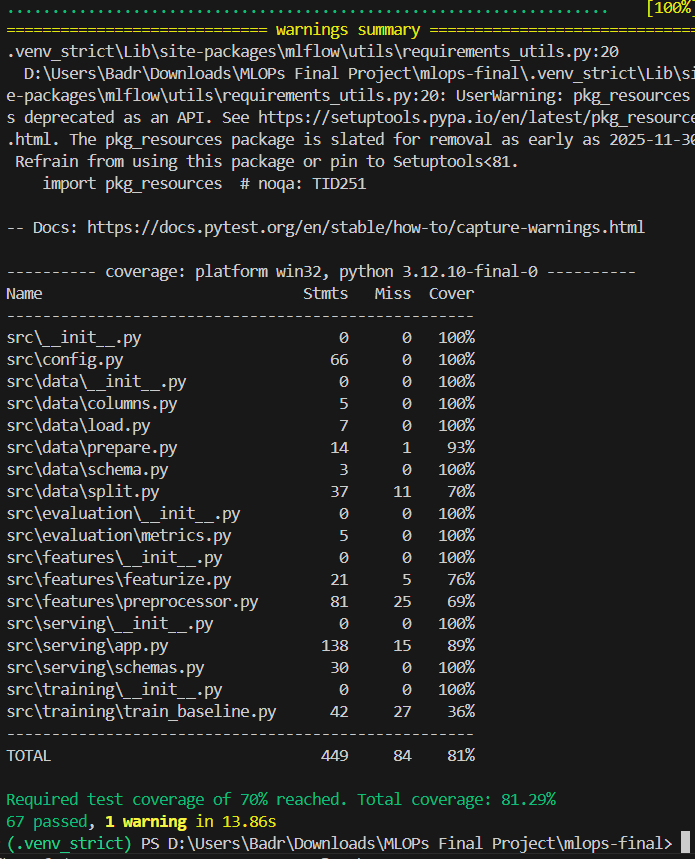
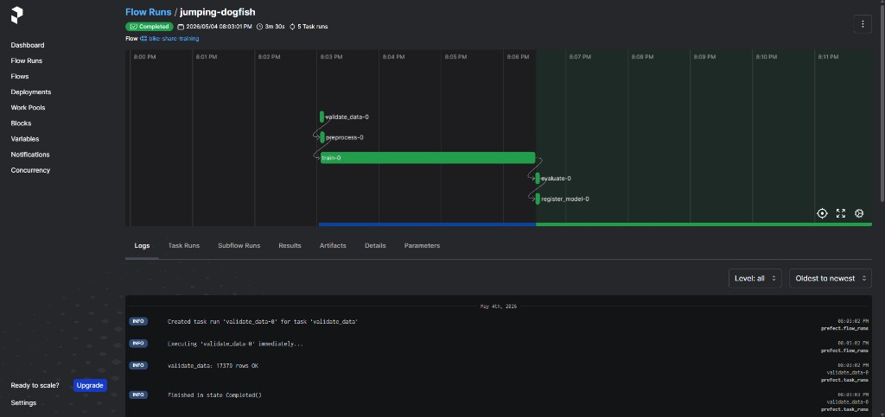
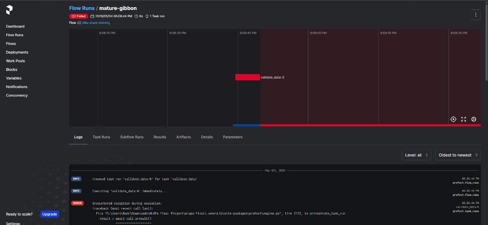

# Technical report — MLOps final project (Bike sharing demand)

This note captures evidence requested for the pipeline and reproducibility sections of the course technical report.

## DVC pipeline

The Data Version Control (DVC) graph below matches `dvc.yaml`: raw data is tracked via `hour.csv.dvc`, then stages **prepare → preprocess → featurize → train**. Training (**train**) depends on both **preprocess** and **featurize** outputs.


To regenerate the figure after dependency installs (`matplotlib`, `networkx`):

```bash
python scripts/render_dvc_dag_png.py
```

If Graphviz is installed, an equivalent diagram can be produced with:

```bash
dvc dag --dot | dot -Tpng -o docs/screenshots/dvc_dag.png
```

### Deterministic repro verification (strict-proof evidence)

For full-marks verification, run on a clean checkout and capture this sequence:

```bash
dvc pull
dvc repro
git diff -- dvc.lock
```

The `git diff -- dvc.lock` output must be empty (no lock hash drift). Save terminal evidence as:

- `docs/screenshots/dvc_repro_deterministic.png`

## Cyclical time features

Hour (`hr`) and month (`mnth`) use sine–cosine encoding (Lecture 03b) in `src/features/preprocessor.py` when `preprocessing.cyclical_hr_mnth` is true in `configs/params.yaml`. This replaces a single raw hour/month with two features each so 23 and 0 are close in feature space.

## Train / test / reference split

Year 0 is used for train, test, and reference; year 1 is used as a production/drift holdout. Within year 0, `train_test_split` is random with a fixed `random_state` (Lecture 03a: document the choice). **Stratify=** is for classification; for regression on skewed `cnt`, stratified quantile binning is possible but not used here—splits are random within the temporal year-0 block.

## Outlier policy (documented)

Numeric weather inputs are already normalised to about \([0,1]\) in the UCI file. The target `cnt` is right-skewed (peaks on holidays). We do not apply IQR or Isolation Forest (Lecture 03a) in this pipeline: the model is a Random Forest, which is relatively robust to high-count days, and the rubric does not require outlier treatment. A future improvement would be winsorising or log-transforming the target in an experiment branch.

## Feature importance (f-scores)

After `SelectKBest` fits, ranked F-scores for all engineered features (pre-selection) are written to `docs/feature_scores.json` by the featurize stage. This surfaces which columns the univariate filter considered informative before the top-`k` cut.

## Monitoring SLI/SLOs

- Prediction latency p99 SLO: `< 500 ms` measured via `bike_prediction_latency_seconds`.
- Validation RMSE SLO: `< 80.0` tracked in `data/splits/metrics.json` and the validation gate.
- Input drift share SLO: `<= 0.20` based on `drift_summary.json` (`drift_share_inputs_only`).

## Serving API evidence (`/predict`)

The FastAPI app (`src/serving/app.py`) exposes `GET /health`, `POST /predict`, and `POST /predict/batch`. Automated coverage lives in `tests/test_api.py` (pytest + `TestClient`).

### How to capture a real screenshot (recommended)

1. Start the stack (API on port 8000), for example: `docker compose up --build`.
2. Open Swagger UI at `http://localhost:8000/docs`.
3. Authorize if needed, then open **`POST /predict`** → **Try it out**.
4. Paste a valid JSON payload (field names must match `BikeRecord` in `src/serving/schemas.py`) and click **Execute**.
5. Screenshot the page showing **HTTP 200** and the response JSON containing `prediction`, `confidence`, and `model_version`.
6. Save the image as `docs/screenshots/api_predict_swagger.png` and commit it:

```bash
git add docs/screenshots/api_predict_swagger.png docs/technical_report.md
git commit -m "docs(c4): add real /predict screenshot evidence"
```

After the image exists, it is embedded below (see also `docs/screenshots/api_predict_swagger.png` in the repo).


## Experiment tracking verification (Component 3)

- At least **3 runs** are compared in MLflow UI (see `docs/screenshots/mlflow_runs_1.png`, `mlflow_runs_2.png`, `mlflow_runs_3.png`, and `mlflow_runs_4.png`).
- Production registration/promotion evidence is shown in `docs/screenshots/mlflow_registry_production.png` and the stage-transition code in `src/training/registry.py`.

## CI/CD (Component 5) — evidence and branch protection

- Workflow: `.github/workflows/ci.yml` (stages: **lint** → **test** with coverage floor → **data-validation** → **model-validation**).
- Green CI and local coverage: commit screenshots under `docs/screenshots/` (e.g. `ci_green_run_1.png`, `pytest_coverage_report.png`) and keep them in sync with the report.

Local run (`.venv_strict`, `PYTHONPATH=.`) meeting the **70%** coverage gate — see `docs/screenshots/pytest_coverage_report.png`:



- **Branch protection (manual, required for full marks):** in the GitHub repo **Settings → Branches → Branch protection rules** for `main`, require the workflow jobs above to pass before merge, and use pull requests (no direct pushes that skip checks). The assistant cannot verify your org settings; include a short note in the submission that this rule is enabled, or a screenshot of the rule if your course allows it.

Strict-proof screenshot target:

- `docs/screenshots/branch_protection_main.png`

## Monitoring (Component 6) — “inference count by class” (regression)

This project predicts a continuous rental count. The rubric’s “inference count by class” is implemented as `bike_inference_total` with an **`output_class`** label: predicted demand is binned into `very_low` / `low` / `medium` / `high` / `very_high` (see `src/serving/metrics.py` and `_prediction_output_class` in `src/serving/app.py`). That gives a per–output-class traffic series comparable to class-stratified inference counts in classification.

## Bonus A — Docker containerization (10/10 checklist)

- `docker/api.Dockerfile`: pinned base image, non-root user, healthcheck.
- `docker-compose.yml`: at least **api** + **mlflow** (and **prometheus**), internal service DNS (e.g. `mlflow:5000`, not `localhost` from other containers).
- Evidence: `docker compose up --build` then `GET /health` returns 200; store screenshots such as `docs/screenshots/docker_compose_ps_healthy_1.png`, `api_health_200.png`.

## Bonus B — Pipeline orchestration (Prefect) (10/10 checklist)

- Flow: `flows/training_flow.py` — tasks **`validate_data` → `preprocess` → `train` → `evaluate` → `register_model`** (five tasks; failure in an upstream task stops downstream runs with Prefect’s default dependency graph).
- **UI evidence (you must add the PNGs):** after `prefect server start` (or your Prefect Cloud workspace), run the flow from the UI or CLI, then capture:
  1. **Successful end-to-end run** — save as `docs/screenshots/prefect_flow_run_success.png`.
  2. **Failed run with downstream not executed** — e.g. temporarily raise in `validate_data` or force `evaluate` to fail the R² gate; save as `docs/screenshots/prefect_flow_run_failed_halt.png`.
- Embed in this report (uncomment when files exist):

```markdown


```

## Related documents

- `docs/model_card.md` — model summary
- `docs/data_card.md` — data summary
- `docs/feature_scores.json` — SelectKBest f-statistics (regenerate via `dvc repro` / `featurize` stage)
- `docs/screenshots/quickstart_clean_install.png` — clean-install quickstart evidence (`venv` + install + `pytest` + `dvc repro` + `/health`)
